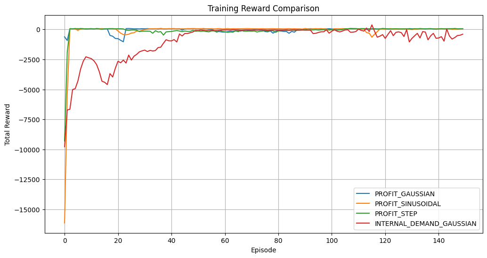
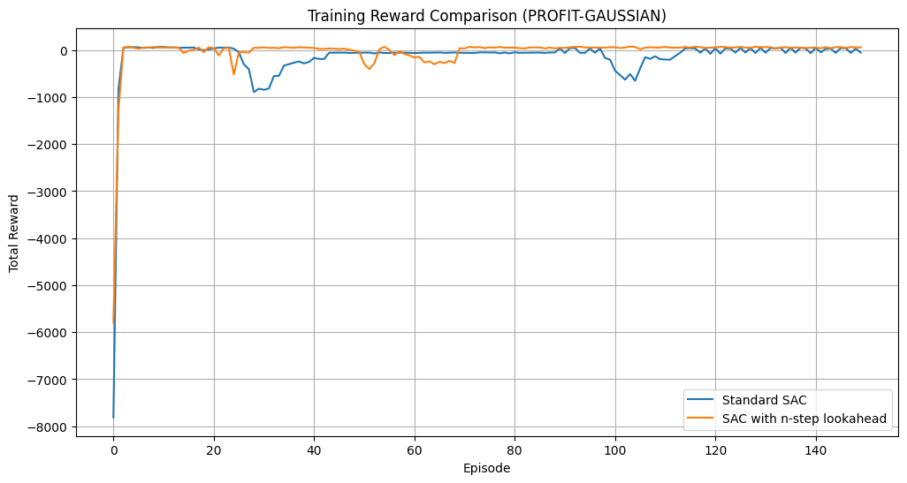

# SDRML PROJECT - Electricity Market RL

A RL project for optimizing battery storage in an electricity market environment. This project implements the Soft Actor-Critic (SAC) algorithm and an enhanced version with n-step lookahead for better handling of delayed rewards.

## Try It in Colab

You can run this project directly in Google Colab:

[](https://colab.research.google.com/drive/1FadSFIsqCJfg8aXFp8n0Ty2XsFuPMjDz?usp=sharing)

## Project Overview

This project explores the application of RL to optimize battery storage operations in a dynamic electricity market. 
We've developed an environment that models the interaction between a household battery system and the electricity grid with stochastic demand and real-time price fluctuations.

Our environment simulates three different scenarios of demand models:
1. Mixture of Gaussians - representing typical residential usage patterns
2. Sinusoidal - capturing cyclical demand variations throughout the day
3. Step function - modeling discrete jumps in demand at specific times

We compare two reward formulations:
- **Profit**: Rewards the agent solely based on revenue generated from selling surplus energy
- **Internal Demand**: Encourages the agent to prioritize meeting household demand before selling energy

The main contribution is the development of a **Lookahead Critic** using **TD(n)** learning to improve long-term decision-making, which helps mitigate overestimation bias and stabilize training.

## Results

Our experiments reveal several insights:
- The lookahead critic substantially improves learning stability and performance, especially in environments with Gaussian demand patterns
- Performance varies across different demand types, with some configurations maximizing profit while others demonstrating more stable behavior
- The approach achieves significantly better cost savings compared to baseline policies



*Comparison of reward accumulation across different model configurations*


*Performance comparison of standard SAC vs. SAC with Lookahead Critic*

## Performance Comparison of Standard SAC vs. Lookahead SAC

| Agent     | Demand     | Avg Reward   | Std Reward  | Avg Reward (Eval)  |
|-----------|-----------|--------------|-------------|--------------------|
| Standard  | Gaussian  | -69.73       | 131.94      | -955.44            |
| Lookahead | Gaussian  | 10.56        | 106.51      | 556.12             |
| Standard  | Sinusoidal| 20.25        | 128.49      | 521.23             |
| Lookahead | Sinusoidal| -1.02        | 66.71       | 562.42             |

## Project Structure

```
electricity_market_rl/
│
├── README.md                     # Project documentation
├── requirements.txt              # Project dependencies
├── main.py                       # Main entry point
│
├── environment/                  # Environment implementation
│   ├── __init__.py
│   ├── electricity_market.py     # Main environment class
│   └── reward_types.py           # Reward function definitions
│
├── agents/                       # Agent implementations
│   ├── __init__.py
│   ├── sac_agent.py              # Base SAC agent
│   ├── sac_agent_ahead.py        # SAC with n-step lookahead
│   ├── networks.py               # Neural network definitions
│   └── replay_buffer.py          # Replay buffer implementations
│
├── training/                     # Training utilities
│   ├── __init__.py
│   ├── trainer.py                # Training loop utilities 
│   └── evaluator.py              # Evaluation utilities
│
├── utils/                        # Utility functions
│   ├── __init__.py
│   ├── config.py                 # Configuration and hyperparameters
│   ├── normalizers.py            # Environment normalizing wrappers
│   └── visualization.py          # Plotting utilities
│
└── experiments/                  # Experiment scripts
    ├── __init__.py
    ├── run_sac.py                # Standard SAC experiments
    ├── compare_agents.py         # Comparison between agent variants
    └── visualize_best.py         # Visualization of best policies
```

## Installation

1. Clone the repository
```bash
git clone https://github.com/anschelalmog/SDRML_Project.git
cd SDRML_Project
```

2. Install dependencies
```bash
pip install -r requirements.txt
```

## Usage

The project can be run using the main.py script with various command-line arguments:

```bash
# Run standard SAC experiments with different configurations
python main.py --experiment sac --episodes 150 --eval-episodes 5 --seed 42

# Compare standard SAC with n-step lookahead SAC
python main.py --experiment compare --episodes 150 --eval-episodes 5 --seed 42

# Visualize the best performing agent
python main.py --experiment visualize

# Visualize demand functions
python main.py --experiment demand
```

## GitHub Repository

For the complete source code and documentation, visit our [GitHub Repository](https://github.com/anschelalmog/SDRML_Project).

## Authors
- Almog Anschel
- Eden Hindi

## License
This project is licensed under the MIT License - see the LICENSE file for details.
